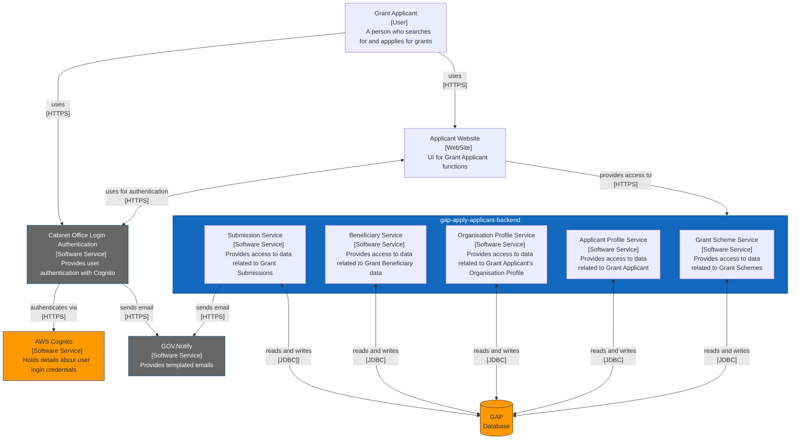

# Getting Started

The Apply Applicant Backend is a SpringBoot application that provides a REST API to perform crud operations on a PostgreSQL datastore to support the frontend UI for Grant Applicants. 

## Running the app (locally)
if you're using something like Intellij or Spring tool suite then there should be a green triangle somewhere or a "run" menu in the top nav bar. Either of these should allow you to run the application.

alternatively you could navigate to the `ApplyBackendApplication` class in the package explorer -> right click -> run.

If you're more of a command line style person then navigate to wherever you've installed the application, move inside the project directory and run the following command

`./mvnw spring-boot:run`

## System Context Diagram

## Checking the project out
The source code can be found in the following repository. 

https://github.com/cabinetoffice/gap-apply-applicant-backend

In order to access this repository you will either need to be added as a contributor to the repository by someone on the team or ideally, added to the following group as a team member. 

https://github.com/orgs/cabinetoffice/teams/grant-application-portal 

I’m sure there are many ways to check the code out depending on which IDE you’re using but the way I have found to be the most simple is to set up a PAT in GitHub and then use that token to check the project out. 

https://docs.github.com/en/authentication/keeping-your-account-and-data-secure/creating-a-personal-access-token

You can set up a PAT token by following these instructions. 

Once you’ve got your token, navigate to wherever you want to store the code on your computer and run the following command 

`git clone https://<YOUR PAT TOKEN>@github.com/cabinetoffice/gap-apply-applicant-backend.git`

You should now be set up ready to work with this project. 

## Software Installation

To run this project locally you must have the following tech installed:

- OpenJDK 17
- Maven

To check whether you have the software installed already and which versions you currently have, you can use the following commands:

Check which versions of Java are installed (if any)

`/usr/libexec/java_home -V`

Check which version of Java your computer is currently using (if any)

`java -v or java --version`

Check if maven is installed

`mvn -v`

### OpenJDK 17

I find using Homebrew to be the easiest way to install and manage software on a Mac so with that in mind, if you haven’t already installed Homebrew then run through these installation instructions.

https://docs.brew.sh/Installation

Once Homebrew is installed, run the following commands:

Install OpenJDK 17

`brew install openjdk@17`

Check where OpenJDK 17 has been installed to

`/usr/libexec/java_home -V`

Set Java Home environment variable, add this to your PATH and add these to the bash profile. The OpenJDK location should come from the output of the command above

`echo 'export JAVA_HOME=/usr/local/Cellar/openjdk@17/17.0.3/libexec/openjdk.jdk/Contents/Home' >> ~/.bash_profile`

`echo 'export PATH=$PATH:$JAVA_HOME/bin' >> ~/.bash_profile`

**NOTE If you are using a shell other than bash then this step will be different for you. If you do not know which shell you are using then run the following command**

`echo $0`

### Maven

If you’re using the Spring Tool Suite IDE then Maven will come pre-installed with this. It will also come pre-installed with Intellij IDEA. There is a Spring Tools plugin for VS Code made by the developers of Spring Boot, but I can’t confirm if Maven comes packaged with this.

To install maven using Homebrew you can run the following command:

`brew install maven`

## Other tools to consider
- **JENV** for managing multiple versions of Java on the Mac 
    - https://www.jenv.be/ 
- **OhMyZsh** an enhancement to the default Mac terminal 
    - https://ohmyz.sh/ 
